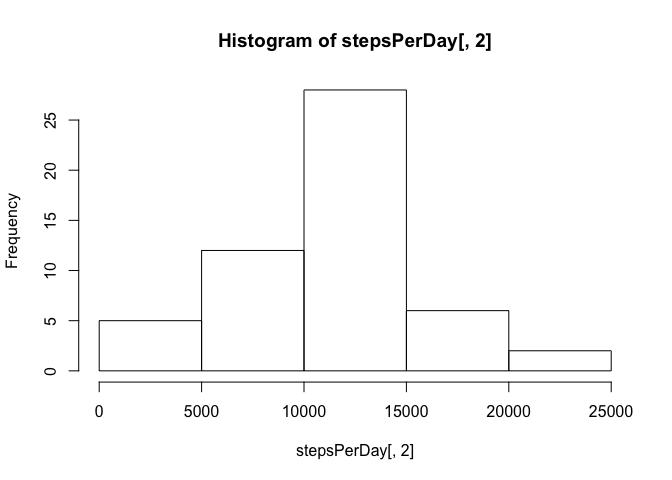
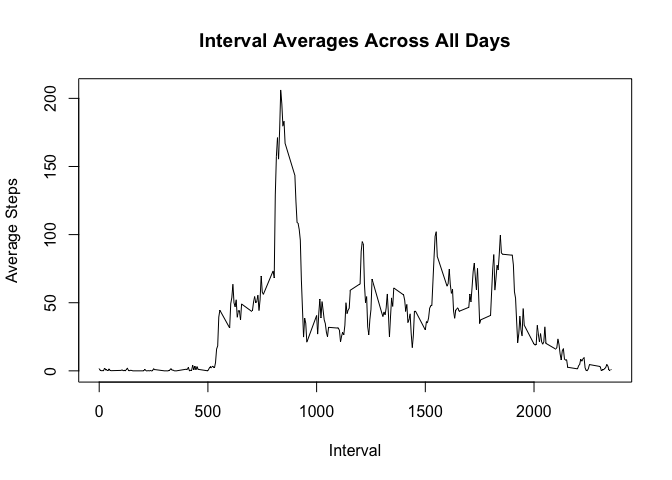
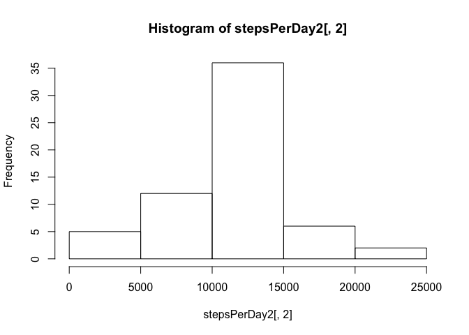
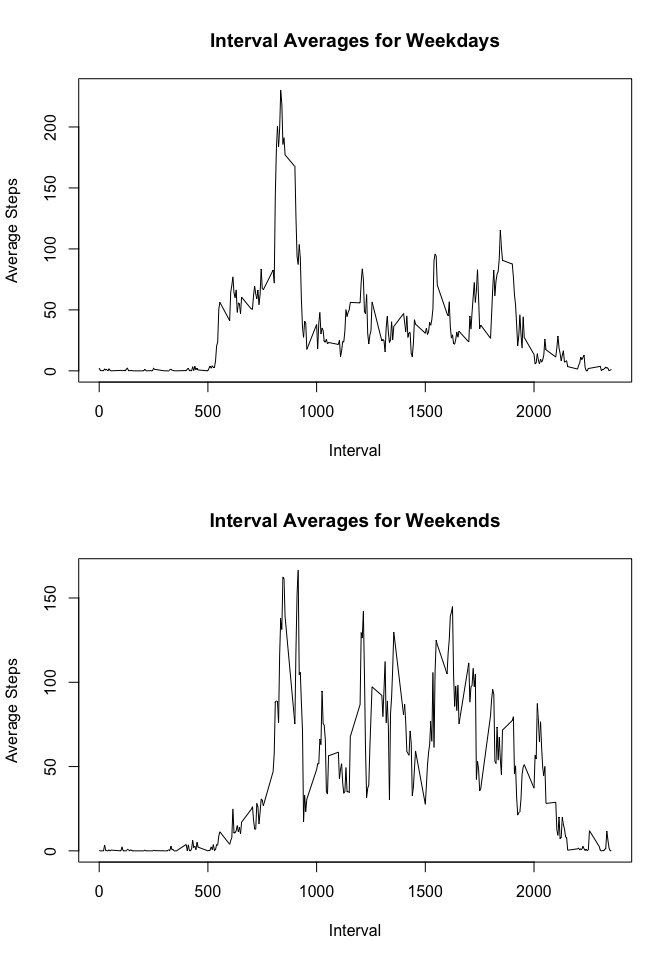

# Reproducible Research: Peer Assessment 1


## Loading and preprocessing the data
### Set the URL

```r
url1 <- "https://d396qusza40orc.cloudfront.net/repdata%2Fdata%2Factivity.zip"
```

### Download & unzip the data

```r
download.file(url1, "Activity_Monitoring")
unzip("Activity_Monitoring")
```

### Load the data into a table

```r
activityTbl<-read.table("activity.csv",header=TRUE, sep=",")
```

### Load librarys needed

```r
library(dplyr)
```

```
## 
## Attaching package: 'dplyr'
```

```
## The following objects are masked from 'package:stats':
## 
##     filter, lag
```

```
## The following objects are masked from 'package:base':
## 
##     intersect, setdiff, setequal, union
```


## What is mean total number of steps taken per day?
Step data is recorded throughout the day and collected in 5-min intervals.
In order to derive the total number of steps per day I've created a summary table 
'stepsPerDay' which totals the steps for each day using the aggrgate() function.


```r
stepsPerDay <- aggregate(activityTbl$steps, list(activityTbl$date), sum)
```

### Histogram of step daily totals

```r
hist(stepsPerDay[,2])
```

<!-- -->

### Computing the steps per day mean and median:

```r
x<-stepsPerDay[,2]
stats1<-summary(x)
Mean1<-as.vector(stats1[4])
Med1<-as.vector(stats1[3])
```

### The steps per day mean is:

```r
Mean1
```

```
## [1] 10766.19
```

### The steps per day median is:

```r
Med1
```

```
## [1] 10765
```


## What is the average daily activity pattern?
Make a time series plot (i.e. type = "l") of the 5-minute interval (x-axis) and the average number of steps taken, averaged across all days (y-axis)

### Summarize the average steps per interval

```r
avgPerInt <- aggregate(activityTbl$steps, list(activityTbl$interval), mean, na.rm = TRUE)
```
### Plot the time series using line graph

```r
plot(avgPerInt, main="Interval Averages Across All Days",
     xlab="Interval", ylab="Average Steps", type="l")
```

<!-- -->


## Imputing missing values
1. find number of missing values 

```r
na_n <- sum(is.na(activityTbl$steps)) # -- this just pulls the count of NA entries
act_na <-subset(activityTbl, is.na(steps)) # -- this gets a subset to work with
x <- as.numeric(count(act_na)) # -- this prints the count of number of NAs
```
The number of missing values is 2304

2. This isn't a large percent of NA's but we can replace missing values with the mean for those intervals

3. Create new dataset with the missing data filled in

```r
actTbl2 <- activityTbl
actTbl2$steps <- ifelse(is.na(actTbl2$steps), 
                    replace(actTbl2$steps, actTbl2$interval==avgPerInt$Group.1, 
                            round(avgPerInt$x)), 
                    actTbl2$steps)
```

### Histogram of Total number of steps taken each day with imputed data

```r
stepsPerDay2 <- aggregate(actTbl2$steps, list(actTbl2$date), sum)
hist(stepsPerDay2[,2])
```

<!-- -->

### Calculate and report the mean and median total number of steps taken per day

```r
x<-stepsPerDay2[,2]
stats2<-summary(x)
Mean2<-as.vector(stats1[4])
Med2<-as.vector(stats1[3])
```
Mean and Median of the stats per day with imputed data:  
### Mean: 1.0766189\times 10^{4}  
#### Median: 1.0765\times 10^{4}


## Are there differences in activity patterns between weekdays and weekends?
### Create a new table with factor variable indicating weekday or weekend

```r
w <- c('Monday', 'Tuesday', 'Wednesday', 'Thursday', 'Friday')
#Use `%in%` and `weekdays` to create a logical vector
actTbl3 <- mutate(actTbl2, 
                  weekday = as.factor(ifelse(weekdays(as.Date(date)) %in% w,
                                   "weekday","weekend")))
```

```
## Warning in strptime(xx, f <- "%Y-%m-%d", tz = "GMT"): unknown timezone
## 'default/America/Chicago'
```

### Subset for weekends 

```r
# averaged across all weekday days or weekend days (y-axis).
wkDay <- subset(actTbl3, weekday=="weekday")
wkEnd <- subset(actTbl3, weekday=="weekend")
avgWkday <- aggregate(wkDay$steps, list(wkDay$interval), mean)
avgWkend <- aggregate(wkEnd$steps, list(wkEnd$interval), mean)
```

## plot the using 2 panels

```r
par(mfrow=c(2,1))
plot(avgWkday, main="Interval Averages for Weekdays",
     xlab="Interval", ylab="Average Steps", type="l")
plot(avgWkend, main="Interval Averages for Weekends",
     xlab="Interval", ylab="Average Steps", type="l")
```

<!-- -->
